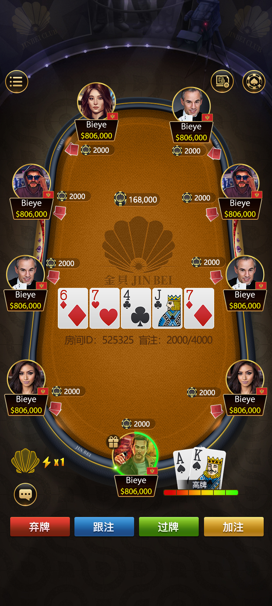
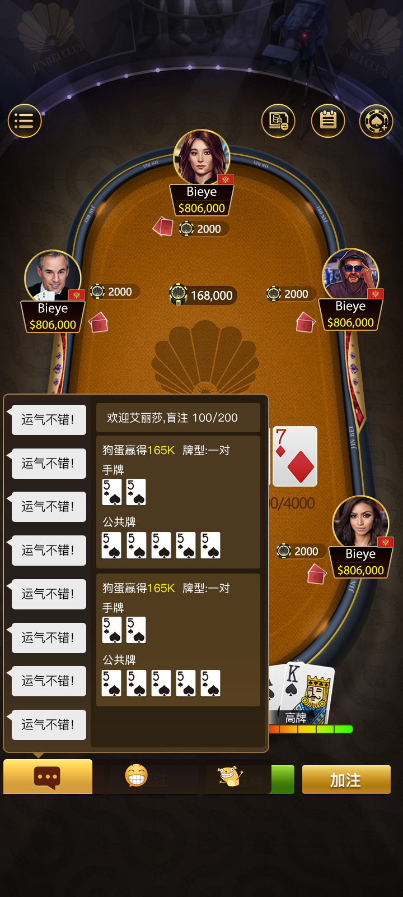
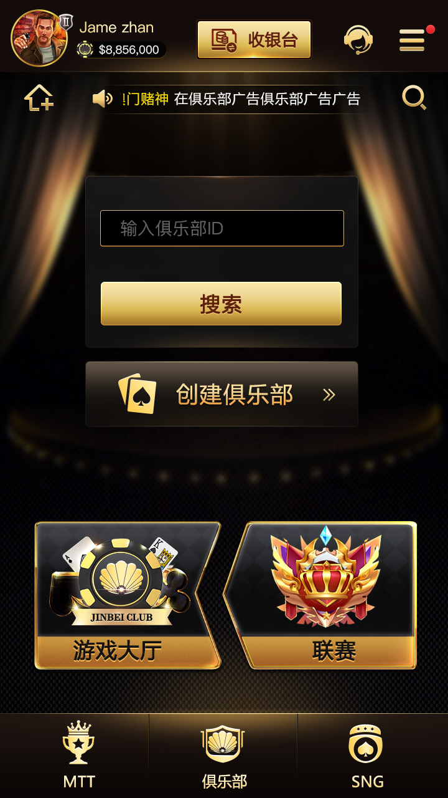
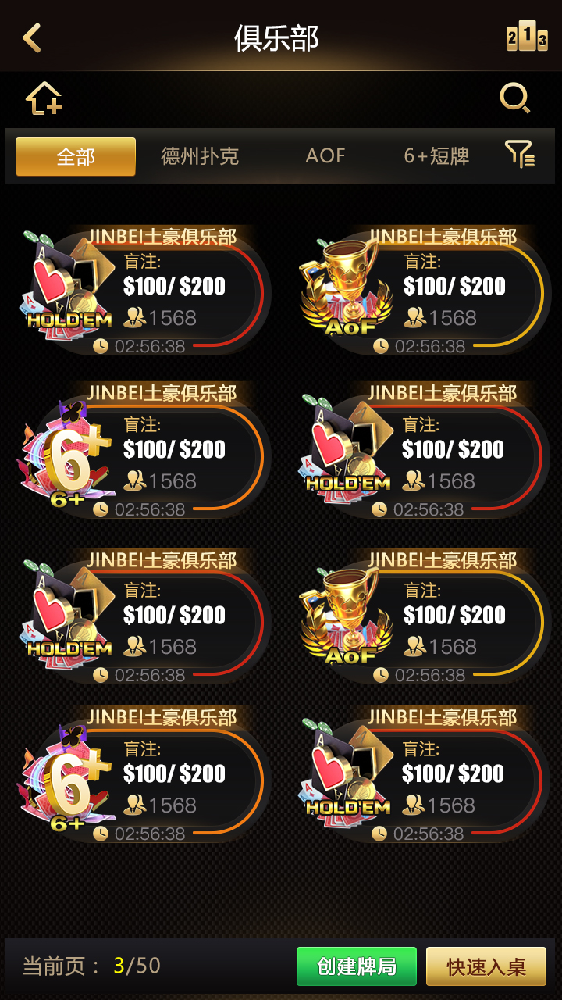
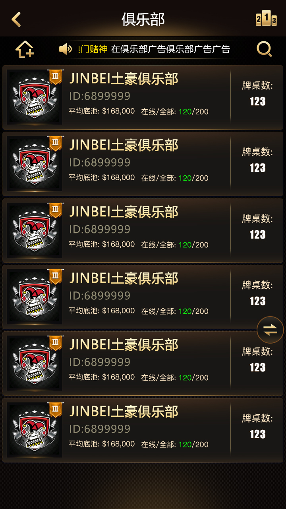
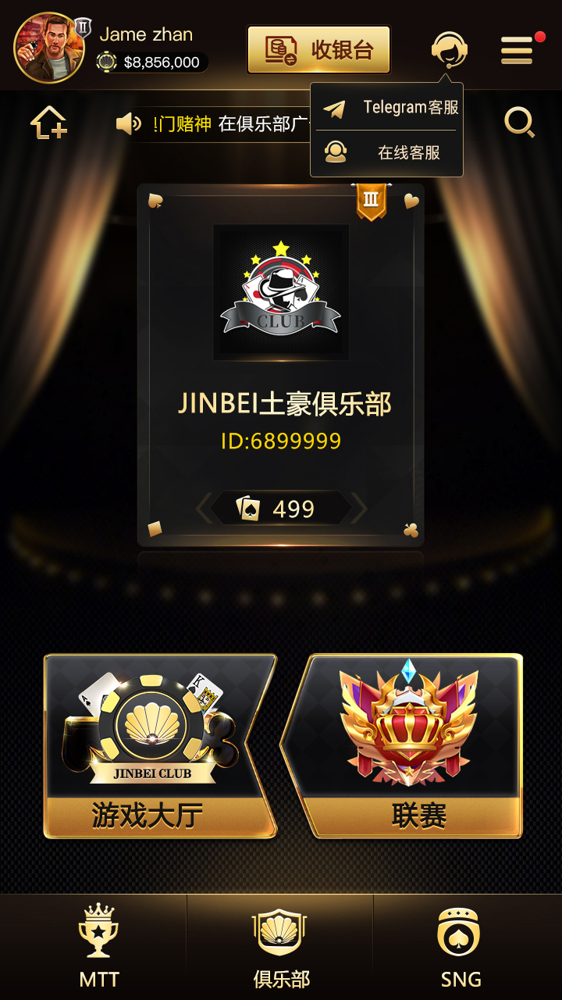
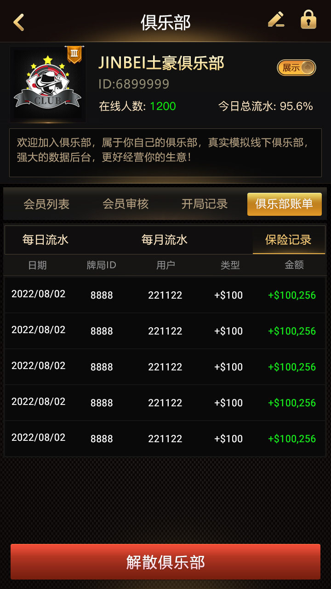

# 德州撲克遊戲原始碼｜Jinbei 俱樂部完整解決方案

面向德州撲克俱樂部、金幣大廳、賽事系統和多玩法房間的完整遊戲原始碼方案。專案展示為 **Jinbei 俱樂部**，覆蓋經典德州、AOF、6+ 短牌、SNG、MTT、德州牛仔、奧馬哈、大菠蘿等 8 個玩法，適合用於棋牌產品展示、技術評估、二次開發和私有化部署。

## 核心玩法

- 經典德州：標準 Texas Hold'em 遊戲流程
- AOF：All-in or Fold 快節奏玩法
- 6+ 短牌：Short Deck Poker 玩法支援
- SNG：單桌 / 多桌 Sit and Go 賽事
- MTT：多桌錦標賽賽事系統
- 德州牛仔：特色德州玩法擴展
- 奧馬哈：Omaha Poker 多手牌玩法
- 大菠蘿：Open Face Chinese Poker 玩法

## 產品截圖

以下圖片直接讀取倉庫目錄 `docs/Assets/Screenshots/` 下的產品截圖。

## 方案能力

- 多玩法撲克遊戲大廳與俱樂部體系
- 金幣大廳、朋友局、俱樂部、聯盟等房間組織方式
- SNG / MTT 賽事流程與報名、開賽、桌位分配邏輯
- 遊戲客戶端、服務端和營運後台的完整產品鏈路
- 支援二次開發、介面換膚、玩法擴展和私有化部署
- 適合德州撲克原始碼、俱樂部原始碼、撲克賽事平台原始碼等方向的技術展示

## 技術與部署

專案可用於搭建德州撲克俱樂部系統、多人線上撲克大廳和賽事平台。實際部署時建議根據業務所在地區的法律法規，僅用於合規的休閒娛樂、技術研究、展示和授權營運場景。

## GitHub Pages

專案首頁檔案位於 `docs/index.html`。如果使用 GitHub Pages，請在倉庫中設定：

- Source：Deploy from a branch
- Branch：main
- Folder：/docs

發布後訪問：

https://masterai-top.github.io/Texas-Holdem-Poker-Game-Source-Code/

## 多語言 README

- [简体中文 README](README.md)
- [English README](README.en.md)

## 相關關鍵詞

德州撲克原始碼、德州撲克遊戲原始碼、德州俱樂部原始碼、撲克原始碼、Texas Holdem source code、poker club source code、poker tournament platform、SNG、MTT、Omaha、AOF、Short Deck、Pineapple Poker。

## 免責聲明

本專案內容用於軟體原始碼展示、技術研究、產品評估和合規娛樂系統開發。請在合法合規的範圍內使用，不得用於違反當地法律法規的用途。
